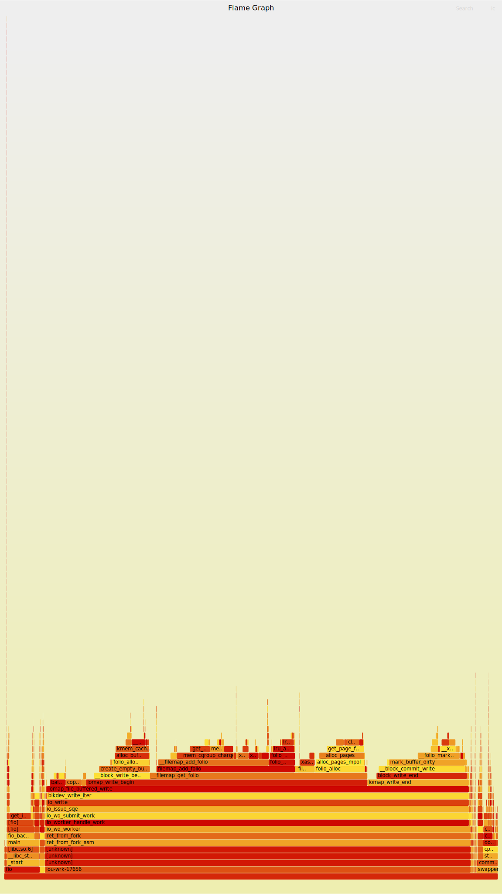
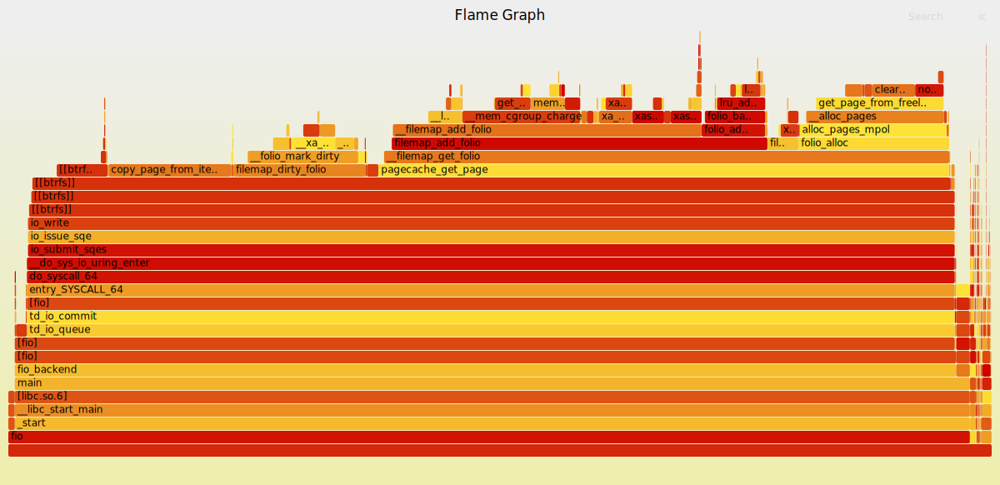
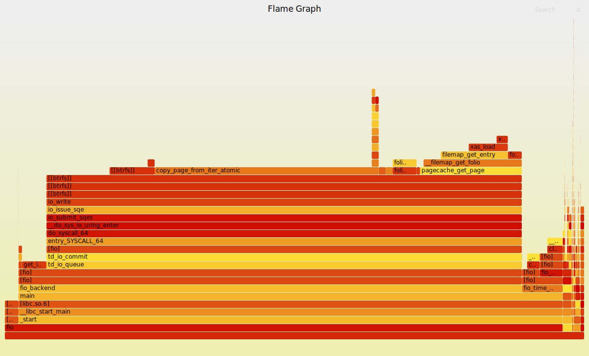

# 2024-07-24

## Page Cache Benchmarking

* The original hypothesis: Page Cache is too slow to be used with modern NVMe devices.

```
$ fio --direct=0 --rw=write --size=32G --bs=1M --filename=/dev/nvme1n1p2
2952MiB/s

$ fio --direct=1 --rw=write --size=32G --bs=1M --filename=/dev/nvme1n1p2
6587MiB/s
```

* Parameters to control writeback when benchmarking page cache:

```
vm.dirty_background_ratio=80 # default 10, triggers writeback when threshold reached
vm.dirty_ratio=90 # default 20, blocks when threshold reached and switch to direct
```

* But `O_DIRECT` behavior is different for a block device and a regular file.

### Fio with block device

```
$ head -5 /proc/meminfo
MemTotal:       64951852 kB
MemFree:        29651472 kB
MemAvailable:   63573604 kB
Buffers:        33556620 kB     # !!!
Cached:           132944 kB
```

### Fio with regular file

```
$ head -5 /proc/meminfo
MemTotal:       64951852 kB
MemFree:        30639684 kB
MemAvailable:   63801840 kB
Buffers:            2196 kB
Cached:         33703140 kB     # !!!
```

* `Cached` works as expected for a page cache.
* `Buffers` is just IO buffer and does not survive longer than an issuing process.
    * This is used while updating non-files, i.e. inodes, internal fs structures etc.

## Flamegraphs

### Block device

```
$ fio --direct=0 --rw=write --size=32G --bs=1M --filename=/dev/nvme1n1p2
2952MiB/s
```



* Similar to the *first run* on a regular file (following section).

### Regular File (None Cached)

```
$ echo 3 | sudo tee /proc/sys/vm/drop_caches
$ fio --direct=0 --rw=write --size=32G --bs=1M --iodepth=1 --filename=test --numjobs=1 --invalidate=0 # First run (Nothing in page cache)
3795MiB/s
```



### Regular File (All Cached)

```
$ fio --direct=0 --rw=write --size=32G --bs=1M --iodepth=1 --filename=test --numjobs=1 --invalidate=0 # Second run (All in page cache)
10.9GiB/s
```

* NOTE: `--invalidate=0` is pretty important, otherwise `fio` will do flush as the first thing!
* Raw memory bandwidth limit is around 96GB/s (2x DDDR5-6000 = 2x48GB/s).


